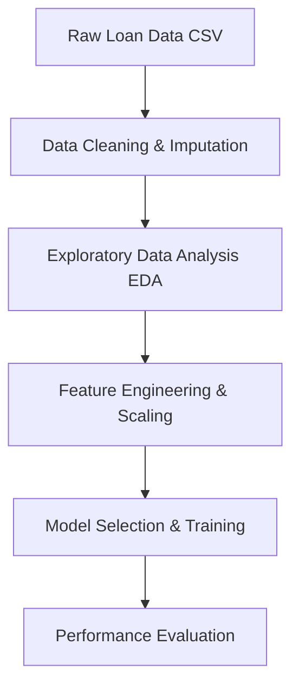

# 🏦 CreditWise Loan System 

<p align="center">
  
  
  
  
</p>

<p align="center">
  <strong>An End-to-End Machine Learning-powered Loan Approval & Risk Assessment Solution.</strong>
</p>

---

## 📌 Overview
**CreditWise Loan System** is a machine learning project designed to help financial institutions make fast, accurate, and unbiased loan decisions. By analyzing applicant financial data, personal history, and credit attributes, the system acts as a reliable binary classifier to predict whether a loan application should be **Approved** or **Rejected** before undergoing final manual review.

### 🎯 Project Objectives
- Build a highly precise classification pipeline utilizing supervised learning techniques.
- Minimize financial risk (False Positives) while maintaining a fair, automated approval workflow.
- Streamline standard workflows: from raw Data Wrangling and Feature Engineering to Model Testing and Comparison.

---

## 🛠️ Tech Stack & Tools

| Category | Technologies |
| :--- | :--- |
| **Language** |  |
| **Data & Modeling** |    |
| **Visualization** |   |

---

## ⚙️ Core Project Workflow




## 🧠 Machine Learning Engine
Exploratory Data Analysis (EDA): Visualizing distributions, tracking structural imbalances, and computing correlation matrices using Seaborn and Matplotlib.

Feature Engineering: Handling multi-collinearity, managing skewness, standardizing numeric balances, and utilizing label/one-hot encoding on categorical profiles.

Binary Classification: Training algorithms to predict structural default risks vs. creditworthiness.

#### The project systematically builds, tunes, and contrasts classic algorithms to identify the ideal risk-mitigator:

| Logistic Regression: Used as the linear baseline profile to judge structural coefficients.

| K-Nearest Neighbors (KNN): Distance-based approach capturing localized applicant trends.

| Naive Bayes: Probabilistic framework highlighting structural indicator distributions.Because misclassifying a high-risk applicant (False Positive) is far costlier than missing a safe loan, the models are scrutinized beyond basic Accuracy using:

Precision: Minimizing sudden credit defaults.

Recall / Sensitivity: Maximizing potential safe market reach.

F1-Score: Striking a balanced harmonic mean between precision and target recall.

## 🚀 Getting Started & Installation
Follow these quick commands to spin up the system locally on your environment machine:

1. Clone the Repository
```Bash
git clone [https://github.com/mkdirharsh108/CreditWise-Loan-System.git](https://github.com/mkdirharsh108/CreditWise-Loan-System.git)
cd CreditWise-Loan-System
```
